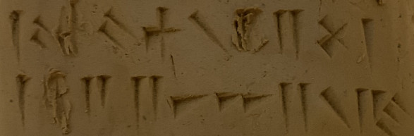
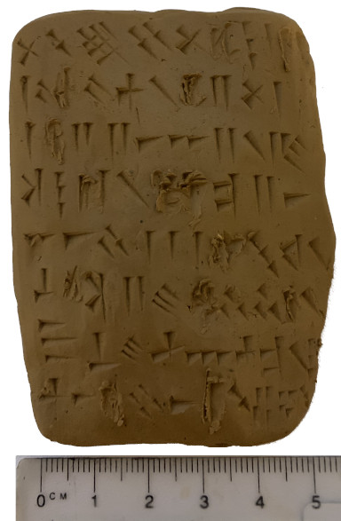

# Cuneiform Error Correction Coding

> Wall, wall! ... wall, ... wall!
> - *Potentially interesting text from a clay tablet with some words annoyingly obscured by damage*

#### A character persistence problem
Clay tablets with [cuneiform](https://en.wikipedia.org/wiki/Cuneiform) writing 
on them are some of the most persistent prose recording devices we know of.
Tablets created around 3,000 BC still exist and can still be read. 

There are limits though: characters pressed into tablets with a reed stylus 
become obscured due to tablet damage over time.

> The back [of the extremely important tablet about an ark] is damaged in the 
> middle of most lines, with the result that not everything there can be read 
> now... 
> - Finkel [1], p106 

#### Potential enhancements
To somewhat cater for this when making new tablets, several different methods 
could be employed, such as making more robust tablets, duplicate copies and so 
on. All methods have disadvantages (cost, effort etc.) but here we consider 
one which, if employed, only increases effort a bit^ which is the use of *error 
correction coding*.

*^ as yet un-quantified*

#### Error correction codes 
To enhance text resilience of text or signals within a body of them, *error 
correction coding* [2] can be employed. These are methods that add redundant 
content which then, with simple algorithms, can be used to fill in a certain 
amount of missing characters/symbols.

Error correction coding is used by modern media that can suffer physical 
damage, such as compact disks. It's also used for transmitted messages in 
cases where retransmission of broken messages is unfeasible, for example very 
long message travel time, as is the case when radio stations communicate with 
interplanetary space probes.
 
Error correction codes are more efficient than simply making two copies of a 
message: modern codes require less than 25% more characters than the original 
message. Simple scheme, such as the one here, require 50% more. Also, the 
correction code is *within* the message, as opposed to being part of a pair 
which must then be kept associated for error correction usability. Keeping 
pairs of things associated over time is essentially impossible, as any sock 
owner knows.


## Demonstration

This demonstration encodes a limited writing of English into cuneiform and caters 
for a certain level of character loss: no more than 1 in each set of 3 characters.

The [cuneiform_ecc.py](cuneiform_ecc.py) file is a [Python](https://en.wikipedia.org/wiki/Python_(programming_language)) 
software script which takes, as input, limited English prose (only letters,
',' & '.') and produces error correction-encoded cuneiform, optionally with
a number of characters obscured to test message recovery, formatted to a fixed character 
with to allow for good tablet calligraphy on rectangular tablets.

It does this in 4 main steps:

1. **Encoding**
    - English prose has its punctuation removed, including space, and all characters
    are moved to upper case.
    - If the length of characters in the text us odd, '_' is added at the end to make
    an even-length text for pair encoding
    - For every 2 upper-case characters, an error correction character is calculated
    and inserted after the pair
2. **Transliteration**
    - English upper case letters, both original text and error correction characters,
    are transliterated into simple cuneiform characters
3. **Random obscuring**
    - A random number of characters - no more than 1/3 of the input text, no more than
    one in any original pair + correction character triplet - are obscured, that is
    the cuneiform characters are replaced with '-' indicating a lost character
4. **Tablet printing**
    - The resultant cuneiform characters are printed in lines with `n` characters per 
    line where the user specifies `n`.
    - The final line is centre space-filled with blanks (as per cuneiform norms) if 
    the message doesn't neatly divide into *n* characters  
    
An additional, optional, step is:

* **Textual reconstruction**
    - the obscured cuneiform can be fed back into a stand-alone function which will
    'plug' any missing characters
    - every 3rd character - the redundant additions - are also removed
    - conversion back to English capitals can be selected
    - English punctuation and spaces can not be re-added as their removal results 
    in their placement information being lost for good
    
These steps are detailed in [Methods](#methods) below.


## Example
The following text is input to the Python script:

```
Irving had a little lamb,
its fleece was black as mud,
And everywhere Irving went,
the lamb left a little thud.
```

After **Encoding** we have:

```
IRZVICNGTHAHDADLITTTLLEPLALMBNITA
SFXLEPECGEW_ASSBLMACCKAKSMDUDXANN
DEHVEZRYOWHCERVEIMRVLINVGWBENRTTL
HELLALMBNLEPFTYALLITATLDETXHUAD_C
```
(linebreaks added for readability)

Note you can just make out the text of he original if you ignore every 3rd character 
and add in punctuation and spaces.

After **Transliteration** we have:

```
𒉽𒃵𒀽𒍞𒉽𒆳𒑉𒁹𒁹𒁹𒁹𒑊𒀹𒑊𒈦𒀹𒈦𒈫𒉽𒁹𒁹𒁹𒈫𒈫𒀸𒐀𒈫𒀹𒈫𒑋
𒋡𒑉𒉽𒁹𒀹𒁇𒋰𒄑𒈫𒀸𒐀𒀸𒆳𒁹𒁹𒁹𒀸𒑈𒃰𒀹𒁇𒁇𒋡𒈫𒑋𒀹𒆳
𒆳𒐺𒀹𒐺𒁇𒑋𒈦𒐁𒈦𒄑𒀹𒑉𒑉𒈦𒀸𒑊𒍞𒀸𒀽𒃵𒐉𒇹𒑈𒑊
𒆳𒀸𒃵𒍞𒀸𒉽𒑋𒃵𒍞𒈫𒉽𒑉𒍞𒁹𒁹𒁹𒑈𒋡𒀸𒑉𒃵𒁹𒁹𒈫𒑊𒀸𒈫𒈫𒀹
𒈫𒑋𒋡𒑉𒈫𒀸𒐀𒋰𒁹𒐉𒀹𒈫𒈫𒉽𒁹𒀹𒁹𒈫𒈦𒀸𒁹𒄑𒑊𒐁𒀹𒈦𒃰𒆳
```
(linebreaks added for readability)

Using the simple lookup function at [cuneiform_ecc.py#L38](cuneiform_ecc.py#L38) you can easily recreate
the encoded English capitals from this cuneiform character set.

After **Random obscuring** we have:

```
𒉽𒃵𒀽𒍞𒉽-𒑉𒁹-𒁹𒁹𒑊-𒑊𒈦𒀹-𒈫𒉽𒁹𒁹-𒈫𒈫𒀸𒐀𒈫𒀹𒈫𒑋
𒋡𒑉-𒁹𒀹--𒄑𒈫𒀸𒐀𒀸𒆳𒁹𒁹𒁹-𒑈𒃰𒀹𒁇-𒋡𒈫𒑋-𒆳𒆳-
𒀹𒐺𒁇𒑋𒈦𒐁𒈦𒄑𒀹𒑉-𒈦𒀸-𒍞𒀸-𒃵𒐉𒇹𒑈𒑊𒆳-
𒃵-𒀸𒉽𒑋-𒍞-𒉽𒑉𒍞𒁹𒁹-𒑈𒋡𒀸𒑉𒃵-𒁹𒈫𒑊𒀸𒈫𒈫-𒈫𒑋
𒋡𒑉𒈫𒀸𒐀𒋰𒁹𒐉-𒈫𒈫𒉽-𒀹𒁹𒈫-𒀸𒁹𒄑-𒐁𒀹𒈦𒃰𒆳
```
(linebreaks added for readability)

Notice that a quasi random 26 of the total 132 cuneiform characters/symbols have been 
replaced with a hyphen, `-`.

The replaced characters are entirely re-computable using the function `plug()` at 
[cuneiform_ecc.py#L73](cuneiform_ecc.py#L73).

After **Tablet printing** we have:

```
𒉽𒃵𒀽𒍞𒉽-𒑉𒁹-𒁹
𒁹𒑊-𒑊𒈦𒀹-𒈫𒉽𒁹
𒁹-𒈫𒈫𒀸𒐀𒈫𒀹𒈫𒑋
𒋡𒑉-𒁹𒀹--𒄑𒈫𒀸
𒐀𒀸𒆳𒁹𒁹𒁹-𒑈𒃰𒀹
𒁇-𒋡𒈫𒑋-𒆳𒆳-𒀹
𒐺𒁇𒑋𒈦𒐁𒈦𒄑𒀹𒑉-
𒈦𒀸-𒍞𒀸-𒃵𒐉𒇹𒑈
𒑊𒆳-𒃵-𒀸𒉽𒑋-𒍞
-𒉽𒑉𒍞𒁹𒁹-𒑈𒋡𒀸
𒑉𒃵-𒁹𒈫𒑊𒀸𒈫𒈫-
𒈫𒑋𒋡𒑉𒈫𒀸𒐀𒋰𒁹𒐉
-𒈫𒈫𒉽-𒀹𒁹𒈫-𒀸
𒁹𒄑-𒐁. . 𒀹𒈦𒃰𒆳
```

Here we have lin breaks added after each 10 symbols - could have been any number. Note
also that the last line is margin-justified (spaces added to the middle).


**Figure 1**: An inscription of the first 8 lines of symbols from this example onto a 
small clay tablet. Note that the obscured characters are deliberately obscured in the 
clay.

### Further use
This code can be used as a Python command line program as follows:

```
~$ python3 cuneiform_ecc.py {TEXT} [-h] [-w WIDTH] [-o] [-t] [-p] [-r]
```

Positional arguments:
  * TEXT
    * The input limited English text to encode

Optional arguments:
  * -h, --help
    * show this help message and exit
  * -w WIDTH, --width WIDTH
    * The input limited English text to encode
  * -o, --no-obscuring
    * Prevents random character obscuring
  * -t, --triplet-printing
    * Enables triplet printing
  * -p, --no-printing
    * Prevents tablet printing
  * -r, --reconstruction-printing
    * Prints reconstructed text

Examples:

```
~$ python3 cuneiform_ecc.py "I read my tablet, ate my lunch, prepared my tablet, wrote it"
```
This encodes the given text, obscures it and tablet prints it to:

```
-𒃵𒀽𒀸𒀹-𒈦𒑋--
𒁹𒆜𒀹𒋡-𒈫𒀸𒐀𒁹𒀹
𒁹𒁹𒀸𒄑𒑋𒐉𒑖𒈫𒐁𒀸
𒑉𒆳𒐀𒑊𒐀-𒃵𒀸𒍞𒐀
-𒐀-𒀸𒍞𒈦𒑋𒐀-𒁹
𒆜𒀹𒋡--𒀸𒐀-𒑈𒇹
𒃵𒇹𒀸𒁹𒀸. 𒄑𒉽𒁹-
```

```
~$ python3 cuneiform_ecc.py "I read my tablet" -o
```
This encodes the given text but does not obscures it and tablet prints it to:

```
𒉽𒃵𒀽𒀸𒀹𒀸𒈦𒑋𒐀𒐉
𒁹𒆜𒀹𒋡𒋡𒈫𒀸𒐀𒁹𒃰
𒁇. . . . . . . . .
```

```
~$ python3 cuneiform_ecc.py "I read my tablet" -p -r
```
This encoded the given text, obscures it but does not print it. It then reconstructs it and 
prints the reconstructed text:

```
IREADMYTABLET_
```


## Methods
The full source code for the 4 steps listed above is contained within the file 
[cuneiform_ecc.py](cuneiform_ecc.py), however here is an english description also.


### 1. Error correction calculation
This code uses a very simple [finite field arithmetic](https://en.wikipedia.org/wiki/Finite_field_arithmetic)
(Galois field) to calculate a redundant correction character for every character 
pair. 

This is done by assigning every character from A - Z and '_' (used only to make 
input text of even character length for effective pairing of letters) a number
and then adding each pair of characters to produce a sum number which indicates
a redundant character to be added.

For example, if the characters `S` & `T` are input, their values are 18 & 19
respectively so that the sum is `18 + 19 = 37`. The finite field used is 0 - 26
(for A - z + '_') so that 37 'wraps around' becoming `37 - 27 = 10` which 
indicates `K` so we get he sequence `STK`.

Now, if `S` were to be accidentally erased from the sequence (as would happen
due to clay tablet damage), we can recalculate it by simply using the equation:

```
x + 19 = 27 + 10
```
Since we know `T` is 19, `K` is 10 and the finite field is 27.

Solving this is:

```
x = 27 + 10 - 19
  = 37 - 19
  = 18
  = 'S'
```

### 2. Transliteration
The characters A - z + '_' are transliterated to simple cuneiform symbols with the
English characters [commonly held to be the most frequent](https://en.wikipedia.org/wiki/Letter_frequency) 
given the simplest symbols, for example:

```
E   𒀸
T   𒁹
A   𒀹
...
Q   𒆜
Z   𒀽
_   𒃰
```
See the full lookup table at [cuneiform_ecc.py#L38](cuneiform_ecc.py#L38).

Complex or compound cuneiform symbols, such as `𒋪` are not used in this lookup to keep 
hand-writing of symbols simple.
 

### 3. Random obscuring
A random number of characters up to a maximum of 1/3 of the total character length of the text
is selected to be obscured.

A maximum of 1 in every 3 characters, counted in sets of three from the start, are obscured.

This ensures the correction limit of the error correction code isn't exceeded.


### 4. Tablet printing
The obscured cuneiform text is then printed in sets of `n` with the default `n` being 10.

The remainder of `text length` by `n` is then centre-padded to 10 to fill in the last line.


### 5. Textual reconstruction
Reconstruction of the text from obscured cuneiform simply reverses the original processes:

* reverse transliteration occurs - cuneiform symbols back to English capitals
* using the `plug()` (see[cuneiform_ecc.py#L73](cuneiform_ecc.py#L73)), any obscured characters in a symbol
triplet are reconstructed
* every 3rd English capital - the ECC addition - is removed


## References

[1] Finkel, Irving. *The Ark Before Noah*, Hodder & Stoughton, London (2014). ISBN 978-1-444-75708-8
[2] Wikipedia. *Error correction code*, Online encyclopedia article (2020). https://en.wikipedia.org/wiki/Error_correction_code, accessed 2020-03-04


## Licenses
This code and all other material in this repository is released under the [Creative Common Attribution 4.0 International (CC-BY 4.0)](https://creativecommons.org/licenses/by/4.0/) 
license which means you are free to:

* **Share** — copy and redistribute the material in any medium or format
* **Adapt** — remix, transform, and build upon the material for any purpose, even commercially. 

As long as:

* **Attribution** — You must give appropriate credit, provide a link to the license, and indicate if changes were made. You may do so in any reasonable manner, but not in any way that suggests the licensor endorses you or your use.

* **No additional restrictions** — You may not apply legal terms or technological measures that legally restrict others from doing anything the license permits.


## Contacts
*author*:  
**Nicholas J. Car**  
<https://orcid.org/0000-0002-8742-7730>  
<nick@kurrawong.net>  

Contact Nick for any matters.
